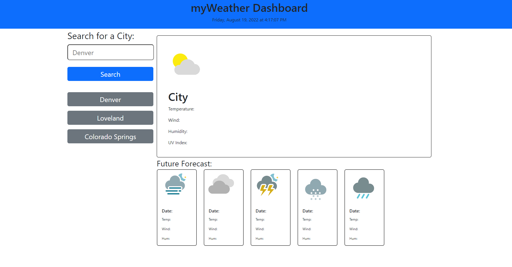

# myWeatherDashboard

## Description

This project was build with Bootstrap and jQuery Api libraries. The standard container, row, column method of Bootstrap was uses to organize the layout of the html elements. jQuery methods such as, text(), eq(), and append(), were used for dom manipulation and traversal. [Wetherbit.io](https://www.weatherbit.io) was used to generate the current and future forecast. 

## Installation

Access to repository here:
[Repository url](https://github.com/myang5t3r/myWeatherDashboard)

Live Deployment here:
[https://myang5t3r.github.io/myWeatherDashboard/](https://myang5t3r.github.io/myWeatherDashboard/)

## Usage
The usages of this project is for informational and learning purposes only.  
 
 
